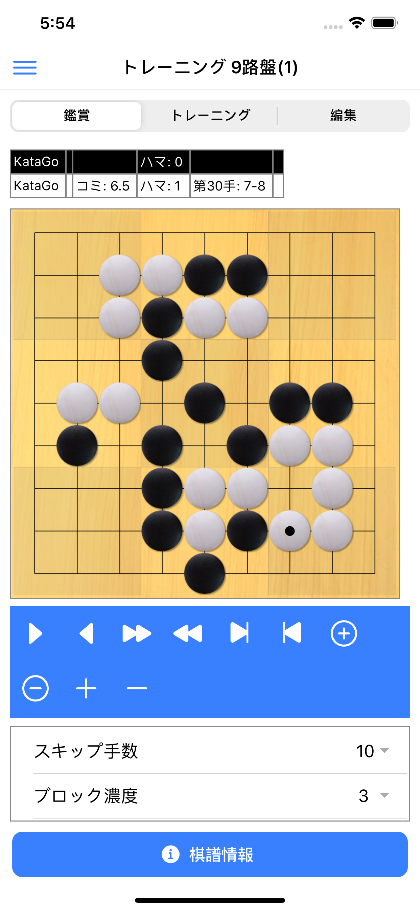

# 脳内碁盤

「脳内碁盤」は、スマートフォン、タブレット向けのアプリです。  
次の2つのことができます。

1. 囲碁の棋譜を、初手から最終手まで、ご自分の頭の中にある碁盤で並べられるようにトレーニングする。
1. 囲碁の棋譜を登録・管理する。

ご自分の頭の中にある碁盤のことを、このアプリでは「脳内碁盤」(のうないごばん)と呼んでいます。  
目を閉じても、碁盤と石の配置が明確にイメージできるようになれば、読みの力が高まり、囲碁の棋力が向上します。  
「脳内碁盤」ができれば、たとえば、街を歩きながらとか、入浴中とかでも、頭の中で棋譜を再生したり、手を考えたりすることができるようになります。  
すでに「脳内碁盤」ができている人や、「脳内碁盤」を作りたいと思わない人には、このアプリはあまり役立ちません。（棋譜の登録・管理用のアプリとしてはお使いいただけます。）  

このアプリでは、囲碁の棋譜を記憶し、それを「脳内碁盤」で再生するトレーニングを段階的に行っていきます。そのトレーニングを行うためのメソッドと、それをサポートする機能を提供します。  
「[KataGo](https://github.com/lightvector/KataGo)」という囲碁AIによるトレーニング用の棋譜が入っています。（9路盤×2、13路盤×2、19路盤×2）  

ご自分で棋譜を入力したり、他の囲碁アプリで作成した棋譜ファイル（SGFファイル）を読み込むこともできます。このアプリで作成した棋譜ファイルを、他のアプリ向けに出力することもできます。  

---

#### ■ 盤面画面(鑑賞)   

#### ■ 盤面画面(トレーニング)   

#### ■ 棋譜登録画面   

#### ■ 棋譜一覧画面   

---

## Appストア (iPhone、iPad向け)
[iPhone、iPad向け紹介ページ](https://apps.apple.com/jp/app/%E8%84%B3%E5%86%85%E7%A2%81%E7%9B%A4/id1519572562)

---

## Google Play (Android向け)
[Android向け紹介ページ](https://play.google.com/store/apps/details?id=com.nifty.jcc02505)

※ Android9 以上のスマホ、タブレットでお使いいただけます。
